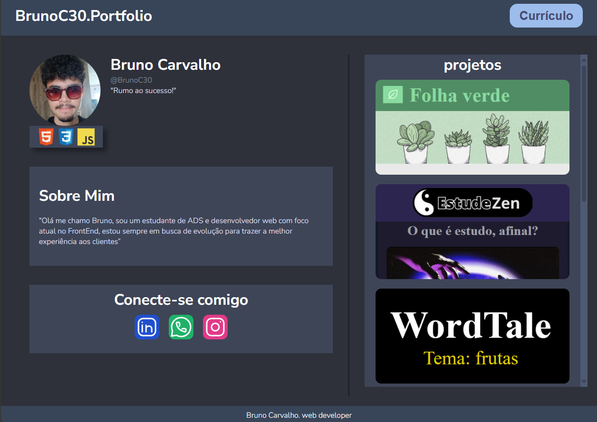

# BrunoC30.Portfolio

>  meu portfolio oficial, contendo todas as minhas informações necessárias
[Acesse aqui](https://brunoc30.github.io/portfolio/)

- página responsiva compatível com mobile
- interface simples e minimalista
- contém link para currículo e projetos 

## tecnologias usadas
- HTML
- CSS 
- JavaScript